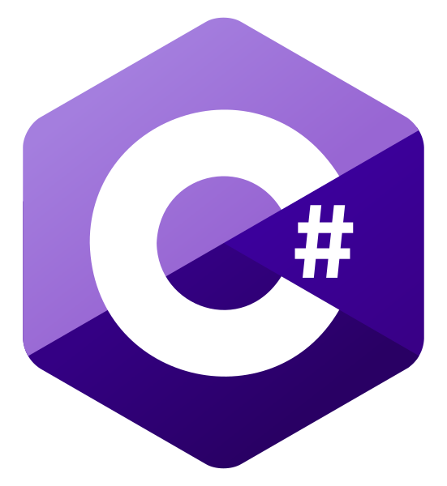

# Computer Science Topics Solved in Various Languages
This repository is to showcase my knowledge with lots of computer science topics and how they can be solved in various programming langauges. It is inspired by various other people that have done similar but I will create them from scratch in the most minimal and clean way I can achieve.
    
img {
    height: 150px;
}
## List of Implementations

## TODO